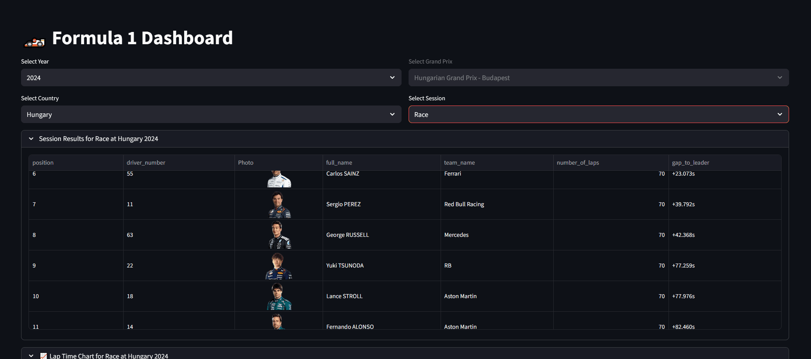

# 🏎️ Formula 1 Dashboard

An interactive data-driven Formula 1 dashboard built with **Streamlit**,
powered by real-time data from the **OpenF1 API**.\
The dashboard provides insights into race weekends, including:

-   📊 Lap time analysis
-   ⭕ Tyre strategy visualization
-   🏅 Driver results & classification
-   🧑 Driver info with headshots
-   🗂️ Session data (FP, Qualifying, Race)
-   🎨 Automatic team color mapping

Everything updates dynamically based on the selected year, Grand Prix,
and session.

------------------------------------------------------------------------

## 🚀 Live Demo

👉 Launch the app here:\
**https://shmeetoo-f1-dashboard.streamlit.app**

------------------------------------------------------------------------

## 🎥 Demo (Animated GIF)

Showcase of the dashboard in action:



------------------------------------------------------------------------

## 🧩 Features

-   Real-time F1 data from OpenF1 API
-   Clean interactive UI powered by Streamlit
-   Plotly visualizations (lap times, tyre stints)
-   Automatic driver & team color mapping
-   Error-resilient API handling (timeouts + retry)
-   Cached API responses for fast performance

------------------------------------------------------------------------

## 💻 Tech Stack

-   **Python 3.10+**
-   **Streamlit**
-   **Pandas**
-   **Plotly**
-   **Requests**
-   **OpenF1 API**

------------------------------------------------------------------------

## 📚 What I Learned

-   Designing clear data pipelines (load → process → visualize)
-   Improving UX with progressive loading and cached API calls
-   Handling unreliable external APIs using timeouts and retry logic
-   Building maintainable UI with Streamlit’s layout system
-   Creating reusable Plotly components for multi-driver comparisons
-   Working with real-world F1 timing and stint data (which is messy!)

------------------------------------------------------------------------

## 🔧 Local Setup

1.  Create and activate a virtual environment:

``` bash
python -m venv venv
source venv/bin/activate  # macOS/Linux
venv\Scripts\activate     # Windows
```

2.  Install dependencies:

``` bash
pip install -r requirements.txt
```

3.  Create a `.env` file in the project root:

```
BASE_API_URL=https://api.openf1.org/v1/
```

4.  Run the app:

``` bash
streamlit run main.py
```

------------------------------------------------------------------------

## 📁 Project Structure

    .
    ├── .devcontainer/
    │   └── devcontainer.json        # Optional development container configuration
    │
    ├── assets/
    │   └── demo.gif                 # Animated preview used in README
    │
    ├── data_loader.py               # API integration + caching + retry
    ├── data_processor.py            # Data formatting, cleaning & transformation
    ├── visualiser.py                # Plotly visualization components
    ├── main.py                      # Streamlit UI + app layout
    │
    ├── requirements.txt             # Python dependencies
    └── README.md

